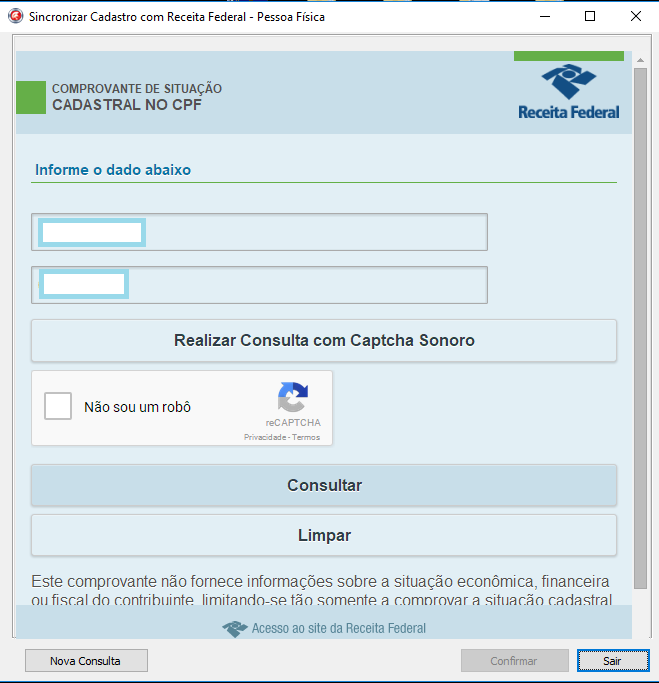
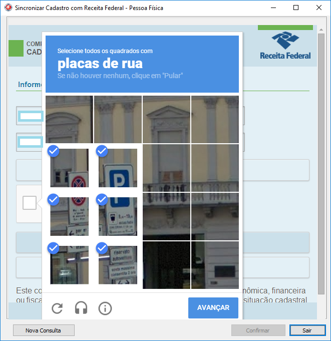
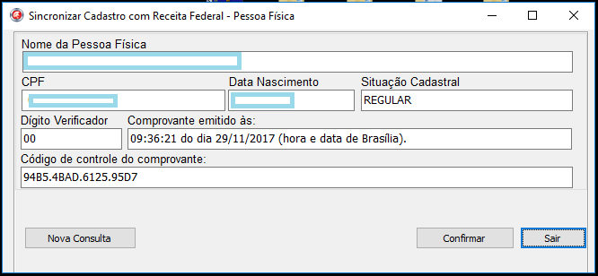

# CPFCheck
Exemplo de consulta situação CPF com TChromium Componente

# Chromium
Estes são os componentes Delphi para incorporar o Chromium.

Confia no projeto [CEF3](https://bitbucket.org/chromiumembedded/cef) para alcançar esse objetivo.

Não hesite em fazer perguntas sobre este [grupo](https://groups.google.com/forum/#!forum/delphichromiumembedded).
